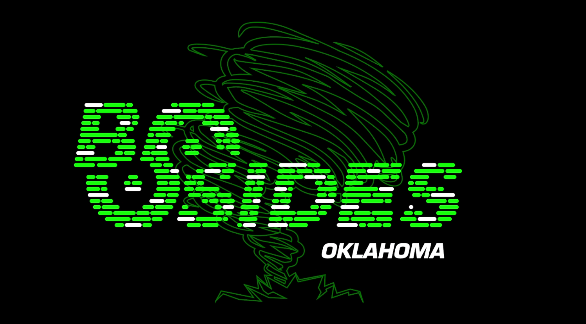
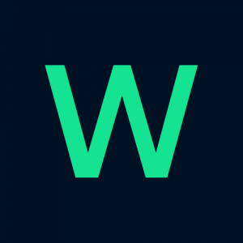
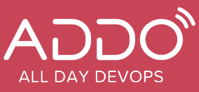

# Talks and Slides


<table>
<thead>
<tr><th>S No</th><th>Date</th><th>@ Venue / Event</th><th>Name of the Talk</th><th>Desc</th><th>Slide Deck</th><th>Recording Link</th></tr>
</thead>
<tbody>
<!-- Meettup details start -->
<tr>
<td width="2%">01.</td>
<td width="8%">16 Dec 2020</td>
<td width="20%"> &nbsp;&nbsp;&nbsp;<a href="https://www.meetup.com/kubernetes-openshift-India-Meetup/" target="blank">Kubernetes & Openshift India Community</a></td>
<td width="25%">How to make OSS Vault HA backed by NFS</td>
<td width="15%">-na-</td>
<td width="25%"  style="text-align:center">
<details>
  <summary>Expand</summary>

```pdf
	./pdf/Vault-HA_slides.pdf
```
</details>
</td>
<td width="2%"> <a href="https://youtu.be/dsXdbA60quI?t=130" target="blank">YouTube</a></td>
</tr>
<!-- Meettup details end -->
<!-- Global Azure Starts -->
<tr>
<td>02.</td>
<td>16 Apr 2021</td>
<td> &nbsp;&nbsp;&nbsp;<a href="https://globalazure.net/" target="blank">Global Azure</a></td>
<td>Dancing with Docker images in Azure DevOps</td>
<td>Click <a href="./pptx/Global_Azure.pptx" >here</a> for PPTX file </td>
<td width="25%"  style="text-align:center">
<details>
  <summary>Expand</summary>

```pdf
	./pdf/Global_Azure.pdf
```

</details>
</td>
<td> <a href="https://youtu.be/brgZCUP3QGU" target="blank">YouTube</a></td>
</tr>
<!-- Global Azure Ends -->
<!-- BSidesOK Starts -->
<tr>
<td>03.</td>
<td>30 Apr 2021</td>
<td> &nbsp;&nbsp;&nbsp;<a href="https://bsidesok.com/" target="blank">BSidesOK</a></td>
<td>Build Versions and gRPC Health Checks In GoLang Containers</td>
<td>Click <a href="./pptx/Global_Azure.pptx" >here</a> for PPTX file </td>
<td width="25%"  style="text-align:center">

<details>
  <summary>Expand</summary>

```pdf
	./pdf/BSidesOK_2021.pdf
```

</details>

</td>
<td> <a href="https://youtu.be/N-kDU5kppuU?t=27368" target="blank">YouTube</a></td>
</tr>
<!-- BSidesOK Ends -->


<!-- World Festival Starts -->
<tr>
<td>04.</td>
<td>18 Aug 2021</td>
<td> &nbsp;&nbsp;&nbsp;<a href="https://worldfestival.com/" target="blank">World Festival</a></td>
<td>Dancing with Docker images in Azure DevOps</td>
<td>Click <a href="./WorldFestival_2021.pptx" >here</a> for PPTX file </td>
<td width="25%"  style="text-align:center">
<details>
  <summary>Expand</summary>

```pdf
	./pdf/WorldFestival_2021.pdf
```

</details>
</td>
<td> -NA- </td>
</tr>
<!-- World Festival Ends -->


<!-- DW Gloabal Cloud Starts -->
<tr>
<td>05.</td>
<td>14 Sep 2021</td>
<td> &nbsp;&nbsp;&nbsp;<a href="https://www.developerweek.com/global/conference/cloud/" target="blank">Developer Week Global Cloud</a></td>
<td>Making OSS Vault Highly Available backed by NFS</td>
<td>-na-</td>
<td width="25%"  style="text-align:center">
<details>
  <summary>Expand</summary>

TBD

</details>
</td>
<td> -NA- </td>
</tr>
<!-- DW Gloabal Cloud Ends -->

<!-- OSPO Starts -->
<tr>
<td>06.</td>
<td>14 Sep 2021</td>
<td> &nbsp;&nbsp;&nbsp;<a href="https://events.linuxfoundation.org/open-source-summit-north-america/" target="blank">Open Source Summit + Embedded Linux Conference + OSPOCon 2021</a></td>
<td> CYOK - Choose Your Own Kubernetes For Local Development</td>
<td><ul><li><a href="https://sched.co/lAN3"> Session Link</li><li> Click <a href="./pptx/CYOK-OSPOCon-2021.pptx"> here</a> for PPTX</li></ul></td>
<td width="25%"  style="text-align:center">
<details>
  <summary>Expand</summary>

TBD

</details>
</td>
<td> -TBD- </td>
</tr>
<!-- OSPO Ends -->


<!-- Central Wisconsin IT Conference Starts -->
<tr>
<td>07.</td>
<td>9 Oct 2021</td>
<td> &nbsp;&nbsp;&nbsp;<a href="https://cwitc.org/2021/sessions#how-to-developgo-deployhelm-and-monitor-cloudnative-app-in-kubernetes" target="blank">The Central Wisconsin IT Conference</a></td>
<td>How to Develop(Go), Deploy(Helm) and Monitor Cloud-Native App in Kubernetes</td>
<td>-NA-</td>
<td width="25%"  style="text-align:center">
<details>
  <summary>Expand</summary>

TBD

</details>
</td>
<td> -TBD- </td>
</tr>
<!-- Central Wisconsin IT Conference Ends -->

<!-- 2021 All Day DevOps Starts -->
<tr>
<td>08.</td>
<td>28 Oct 2021</td>
<td> &nbsp;&nbsp;&nbsp;<a href="https://www.alldaydevops.com/" target="blank">2021 All Day DevOps</a></td>
<td>GoLang App build version in Containers & HealthChecks in gRPC Containers for Kubernetes</td>
<td>-NA-</td>
<td width="25%"  style="text-align:center">
<details>
  <summary>Expand</summary>

TBD

</details>
</td>
<td> -TBD- </td>
</tr>
<!-- 2021 All Day DevOps Ends -->


</tbody>
</table>
